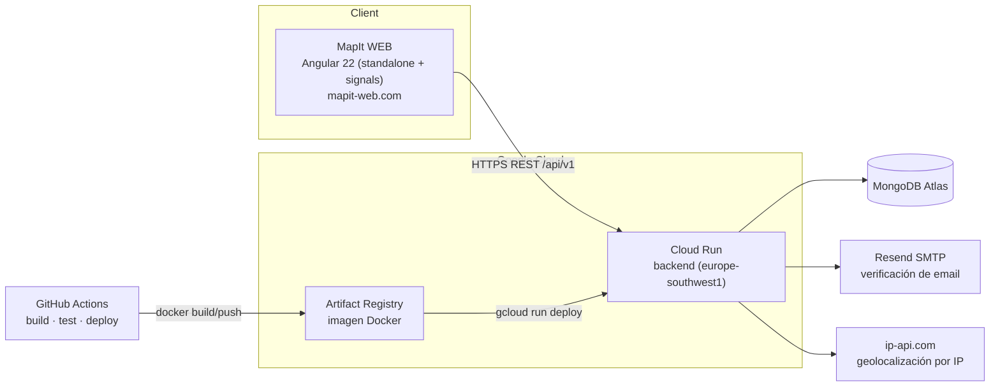

# MapIt API


Backend REST de **MapIt**, una plataforma de eventos y lugares locales geolocalizados con un
componente de gamificación (niveles, XP, capacidades). Java 21 · Spring Boot 3.3 · MongoDB ·
JWT propio · desplegado en Google Cloud Run vía CI/CD con GitHub Actions.

> Proyecto personal de portfolio. El objetivo actual no es cubrir todo el dominio diseñado desde
> el arranque, sino tener una **aplicación mínima pero real y desplegada** (backend + frontend +
> base de datos + CI/CD en producción) sobre la que seguir iterando. Ver el estado exacto de cada
> pieza en [Estado del proyecto](#estado-del-proyecto).

**Repo hermano (frontend Angular):** https://github.com/EMC2-MapItApp/web
**Frontend en producción:** https://mapit-web.com
**API en producción:** https://backend-931882563225.europe-southwest1.run.app/api/v1

---

## Índice

- [MapIt API](#mapit-api)
  - [Índice](#índice)
  - [Estado del proyecto](#estado-del-proyecto)
  - [Arquitectura](#arquitectura)
  - [Stack tecnológico](#stack-tecnológico)
  - [Funcionalidad implementada](#funcionalidad-implementada)
  - [Puesta en marcha local](#puesta-en-marcha-local)
  - [Tests](#tests)
  - [CI/CD y despliegue](#cicd-y-despliegue)
  - [Estructura del código](#estructura-del-código)
  - [Documentación adicional](#documentación-adicional)

---

## Estado del proyecto

El modelo de dominio contempla tres tipos de usuario (**individual**, profesional, entidad), pero
**hoy solo el tipo individual está implementado de verdad**. El sistema de niveles/XP/capacidades
y los tipos profesional/entidad están en progreso — sus entidades (`LevelDefinition`,
`CapabilityDefinition`, `MilestoneDefinition`) ya existen en el modelo pero la lógica de negocio
alrededor está parcialmente construida. No lo interpretes como un roadmap cerrado: es un proyecto
vivo que evoluciona con el tiempo disponible.

| Pieza | Estado |
|---|---|
| Auth (registro, login, verificación de email, JWT propio) | ✅ Completo |
| CRUD de usuario individual + perfil + favoritos | ✅ Completo |
| Publicaciones geolocalizadas (crear, listar, inscribirse) | ✅ Completo |
| Categorías / lugares (árbol categoría → subcategoría → tipo de lugar) | ✅ Completo |
| Geolocalización por IP (fallback de ubicación) | ✅ Completo |
| CI/CD a Google Cloud Run | ✅ Completo |
| Niveles, XP, capacidades, milestones | 🚧 Modelo creado, lógica en progreso |
| Profesionaes / Entidades (Ayuntamientos, Asociaciones, etc.) | 🚧 No implementado |
| Grupos (Creación de grupos públicos y privados) | 🚧 No implementado |

---


## Arquitectura



La API es stateless (sin sesiones ni cookies): cada request se autentica con un JWT propio
(HMAC, sin librería externa) vía cabecera `Authorization: Bearer`.

## Stack tecnológico

Resumen rápido — el detalle completo (versiones, por qué se eligió cada pieza, alternativas
consideradas y enlaces a la configuración real) está en **[docs/STACK.md](docs/STACK.md)**.

| Categoría | Tecnología |
|---|---|
| Lenguaje / runtime | Java 21 |
| Framework | Spring Boot 3.3 (Web, Security, Validation, Data MongoDB, Mail) |
| Persistencia | MongoDB Atlas (Spring Data MongoDB) |
| Auth | JWT propio basado en HMAC (`JwtService`), sin librería externa |
| Validación de contraseñas | zxcvbn (puerto Java, `com.nulab-inc:zxcvbn`) — misma escala 0-4 que el `zxcvbn-ts` del frontend |
| Build | Maven, perfiles `dev` (WAR + Tomcat externo) / `prod` (JAR-en-WAR self-contained) |
| Tests | JUnit 5, Mockito, AssertJ, MockMvc |
| Contenedor | Docker (imagen runtime-only, `eclipse-temurin:21-jre-alpine`) |
| CI/CD | GitHub Actions → Artifact Registry → Cloud Run |
| Hosting | Google Cloud Run (`europe-southwest1`) |
| Email transaccional | Resend (SMTP) |

## Funcionalidad implementada

```
POST   /api/v1/auth/register                   Registro (envía email de verificación)
POST   /api/v1/auth/verify-email               Verificación de cuenta
POST   /api/v1/auth/resend-verification        Reenvío del email de verificación
POST   /api/v1/auth/login                      Login → JWT
GET    /api/v1/auth/me                         Usuario autenticado actual
POST   /api/v1/auth/logout                     Logout (stateless)

GET    /api/v1/users/{id}                       Perfil público de usuario
PATCH  /api/v1/users/{id}                       Editar perfil propio
GET    /api/v1/users/{id}/profile               Detalle de perfil
GET    /api/v1/users/{id}/stats                 Estadísticas de usuario
GET    /api/v1/users/{id}/capabilities          Capacidades desbloqueadas
POST   /api/v1/users/{id}/capabilities/{cid}    Desbloquear capacidad
GET    /api/v1/users/{id}/milestones            Hitos alcanzados
GET    /api/v1/users/{id}/place                 Lugar asociado al usuario
GET    /api/v1/users/{id}/publications          Publicaciones del usuario
POST   /api/v1/users/{id}/favorites/{typeId}    Añadir lugar favorito
DELETE /api/v1/users/{id}/favorites/{typeId}    Quitar lugar favorito

POST   /api/v1/publications                      Crear publicación geolocalizada
GET    /api/v1/publications                      Listar publicaciones
GET    /api/v1/publications/{id}                 Detalle de publicación
GET    /api/v1/publications/author/{authorId}    Publicaciones de un autor
DELETE /api/v1/publications/{id}                 Borrar publicación propia
POST   /api/v1/publications/{id}/enroll          Inscribirse
GET    /api/v1/publications/{id}/enrollments     Ver inscritos
DELETE /api/v1/publications/{id}/unenroll        Desinscribirse

GET    /api/v1/categories/tree                   Árbol categoría → subcategoría → tipo de lugar
POST   /api/v1/categories/main                   Crear categoría (admin)
...    (CRUD completo de categorías / subcategorías / tipos de lugar)

GET    /api/v1/geo/me                            Ubicación aproximada por IP
```

Rutas públicas (GET) vs. protegidas por JWT se declaran en `SecurityConfig`.

## Puesta en marcha local

**Requisitos:** JDK 21, Maven (o el wrapper `./mvnw` incluido), MongoDB accesible (local o Atlas).

```bash
# 1. Levantar solo MongoDB en local con Docker
docker compose -f docker-compose.dev.yml up -d

# 2. Arrancar la API (perfil dev, puerto 8081)
./mvnw spring-boot:run

# 3. Probar
curl -X POST http://localhost:8081/api/v1/auth/register \
  -H "Content-Type: application/json" \
  -d '{"email":"demo@mapit.local","password":"UnaClaveSegura123!","userType":"INDIVIDUAL", "..."}'
```

Variables de entorno relevantes en dev (con default seguro si no se definen, ver
`application-dev.yaml`): `MONGODB_URI`, `MAPIT_JWT_SECRET`, `MAPIT_SMTP_HOST/PORT/USERNAME/PASSWORD`,
`MAPIT_FRONTEND_URL`. Nunca se hardcodean secretos; en prod se inyectan vía Google Secret Manager
(ver [docs/GoogleCloudDeploy.md](docs/GoogleCloudDeploy.md)).

```bash
# Empaquetar
mvn package -P dev    # WAR para Tomcat externo (Tomcat "provided")
mvn package -P prod   # JAR-en-WAR autocontenido, el que usa CI/Docker/Cloud Run
```

## Tests

```bash
./mvnw test                                                    # toda la suite
./mvnw test -Dtest="HashServiceTest,JwtServiceTest,AuthServiceTest"
./mvnw clean verify                                            # lo mismo que corre CI
```

JUnit 5 + Mockito + AssertJ + MockMvc. Desglose completo de qué cubre cada clase de test en
[docs/tests.md](docs/tests.md).

## CI/CD y despliegue

Pipeline en [`.github/workflows/deploy.yml`](.github/workflows/deploy.yml), disparado en cada
push a `main_back`:

1. **CI** — `./mvnw clean verify -P prod` contra un MongoDB real levantado como servicio del
   runner (no mocks para los tests de integración).
2. **Build de imagen** — Docker build (runtime-only, el WAR ya viene compilado por el paso
   anterior) y push a **Google Artifact Registry**.
3. **Deploy** — `gcloud run deploy` publica la nueva revisión en **Cloud Run**
   (`europe-southwest1`), con `--set-env-vars`/`--set-secrets` versionados en el propio workflow
   (nunca solo en la consola de GCP).

Detalle de variables de entorno, secretos en Secret Manager y cómo añadir uno nuevo:
[docs/GoogleCloudDeploy.md](docs/GoogleCloudDeploy.md).

## Estructura del código

```
src/main/java/emc/mapIt/
├── controller/   REST endpoints (finos, delegan en servicios)
├── service/      Lógica de negocio (AuthService, UserService, PublicationService, ...)
├── repository/   Spring Data MongoDB, uno por entidad
├── entity/       Documentos de MongoDB (User, Place, Publication, MainCategory, ...)
├── dto/          Payloads de request/response
├── mapper/       Mapeo manual entidad ↔ DTO (sin MapStruct)
├── config/       Configuración Spring + seeders de arranque (categorías, admin)
└── exception/    ApiException + GlobalExceptionHandler → error JSON consistente
```

## Documentación adicional

- [docs/STACK.md](docs/STACK.md) — stack y servicios en detalle, con el porqué de cada elección
- [docs/tests.md](docs/tests.md) — cobertura de tests por clase
- [docs/GoogleCloudDeploy.md](docs/GoogleCloudDeploy.md) — pipeline y configuración de Cloud Run
- [docs/DockerizacionBackend.md](docs/DockerizacionBackend.md) — dockerización paso a paso
- [CLAUDE.md](CLAUDE.md) — contexto de arquitectura para trabajar en el repo con Claude Code
- [llms.txt](llms.txt) — punto de entrada estructurado para agentes/LLMs ([convención llms.txt](https://llmstxt.org/))
