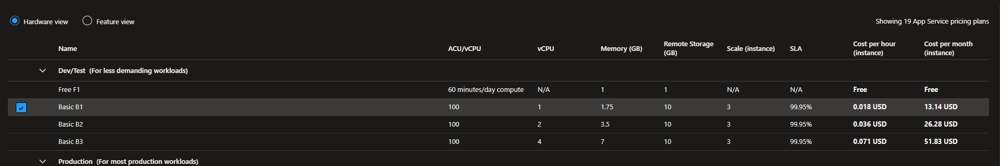

# MapIt – Manual de Despliegue en Azure  
Versión: Producción  
Autor: Eusebio Montero Camacho  

---

## 📌 1. Arquitectura General

La plataforma MapIt se despliega en Azure con la siguiente arquitectura:

- **Frontend Angular** → Cloudflare Pages / Vercel / Static Web Apps  
- **Backend Spring Boot** → Azure App Service (Docker)  
- **Base de datos MongoDB** → Azure Container Instances (ACI)  
- **Registro de imágenes** → Azure Container Registry (ACR)

---

## 📌 2. Backend Spring Boot

# Recursos creados en Azure

| Recurso                                     | Tipo                         | Descripción                                      | Nombre                                    |
| ------------------------------------------- | ---------------------------- | ------------------------------------------------ | ----------------------------------------- |
| Resource Group                              | Contenedor lógico            | Agrupa todos los recursos del proyecto           | `rg-mapit`                                |
| Azure Container Registry (ACR)              | Registro de imágenes Docker  | Almacena las imágenes del backend y MongoDB      | `mapit`                                   |
| App Service (Linux, Docker)                 | Hosting del backend          | Ejecuta la imagen Docker del backend Spring Boot | `mapit-backend`                           |
| Container Instance (ACI)                    | Contenedor independiente     | Ejecuta MongoDB con IP pública y DNS             | `mapit-mongodb`                           |
| Log Analytics Workspace                     | Monitorización               | Recoge logs del ACI (MongoDB)                    | `4748ae85-3d71-492c-84b8-8b96fa5cb668`    |
| Managed Identity                            | Identidad del App Service    | Permite acceso seguro al ACR sin credenciales    | `mapit-backend-identity` (nombre interno) |
| Static Web Hosting (Cloudflare/Vercel/etc.) | Hosting del frontend Angular | Sirve la aplicación web                          | *(según plataforma)*                      |

## 3 Configuracion y creacion de los recursos en Azure:

### 3.1 Suscripcion que es la que define:

-el plan de facturación,

-los límites de recursos,

-las políticas de uso,

-los costes asociados,

-y el contexto administrativo.

### 3.2  Resource Group (RG): Es la unidad lógica donde Azure agrupa y organiza recursos relacionados entre sí.

-Gestionar permisos de forma conjunta

-Aplicar políticas

-Ver costes agrupados

-Eliminar todo un proyecto de una sola vez

-Mantener orden y estructura en la suscripción

### 3.3 App Service Plan : entorno de hosting donde se ejecuta el backend Docker.

